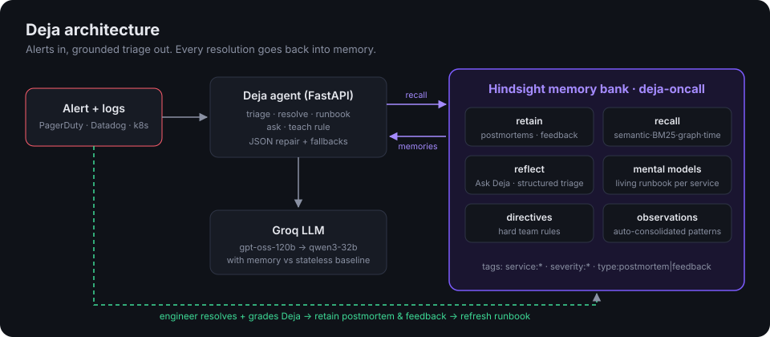

# Deja: the on-call agent that has seen this before

> It's 02:06 UTC and checkout-api is timing out. A stateless AI assistant says *"increase the connection pool and consider failing over the database."* Your team already tried both, in April and in May. The first made it worse. The second took checkout down completely.
>
> Deja remembers that. Its answer is *"This is the third time. The `bulk-export` cron is hitting the primary again. Kill the job. Do **not** fail over. Page Priya."*

Deja is an incident-response agent built on **[Hindsight](https://github.com/vectorize-io/hindsight)** agent memory. It retains every postmortem, every fix that failed and every engineer correction. When an alert fires it recalls the relevant history, and it gets measurably better with each incident the team resolves.



---

## The 60-second demo

1. **Load 6 months of history.** 12 realistic postmortems (Apr–Sep 2026) are retained into a Hindsight bank.
2. **Fire "Checkout latency at 02:06 UTC".** Click **Triage**. The screen shows:
   - **Hindsight recall**: the memories retrieved for this alert, with their type and rank.
   - **Stateless agent vs Deja**: the same LLM on the same alert, without and with memory. The stateless agent recommends exactly the actions that failed in INC-2031 and INC-2064. Deja names the root cause, cites the incidents, lists what *not* to do, and says who to page.
3. **Fire "Brand-new failure: ledger WAL disk".** Deja says plainly that it has never seen this (low confidence, generic steps).
   Resolve it, mark Deja's verdict as **Wrong**, and add a correction. The postmortem and the feedback are retained.
4. **Fire a similar ledger alert again** (Custom alert). This time Deja recognises it, cites the incident you just closed, warns that expanding the PVC only buys time, and pages Sara.
5. Open **Learning curve**, **Living runbooks** (written by Hindsight mental models), **Ask Deja** (Hindsight reflect) and **Team rules** (Hindsight directives).

## How Hindsight memory is used

Memory is the product, not an add-on. Every feature maps to a Hindsight primitive:

| Deja feature | Hindsight API | Where |
|---|---|---|
| Memory bank tuned for SRE work (mission, retain mission, reflect mission, skeptical/literal disposition) | `create_bank` (idempotent upsert) | [`deja/memory.py`](deja/memory.py) `HindsightMemory.ensure_bank` |
| Every resolved incident becomes a postmortem memory, tagged `service:*`, `severity:*`, `type:postmortem`, with structured metadata (root cause, fix, failed attempts, owner, TTR) and the incident's real timestamp | `retain_batch` | `Deja.resolve`, `Deja.seed_history` |
| Engineer verdicts ("Deja was wrong, it was the replication slot") are retained as feedback memories, so mistakes are not repeated | `retain_batch` (`context="engineer feedback"`) | `Deja.resolve` |
| Triage retrieves similar past incidents across services (DNS problems don't care which team owns the pod) | `recall` (semantic + BM25 + graph + temporal, reranked) | `Deja.triage` |
| Hard team rules ("never fail over the primary for pool exhaustion") that override anything the model infers | `create_directive` / `list_directives` | Team rules tab |
| Per-service **living runbooks** that nobody writes by hand, rebuilt after each consolidation | `create_mental_model(trigger={"refresh_after_consolidation": True})`, `get_mental_model`, `refresh_mental_model` | Living runbooks tab |
| "Ask Deja": free-form questions over the whole history | `reflect` (with `based_on` facts shown) | Ask Deja tab |
| Triage without an LLM key: Hindsight reasons over its own memory into a JSON schema | `reflect(response_schema=TRIAGE_SCHEMA)` | `Deja._deja_answer` |
| Memory inspector | `list_memories` | Memory bank tab |

### The learning loop

```
alert ─▶ recall(alert + logs) ─▶ LLM grounded on memories + directives ─▶ triage (vs. stateless baseline)
                                                                              │
engineer resolves + grades Deja ◀──────────────────────────────────────────────┘
        │
        ├─ retain(postmortem, tags, metadata, timestamp)
        ├─ retain(feedback: verdict + correction)
        └─ refresh_mental_model(runbook-<service>)
```

## Run it

```bash
python3 -m venv .venv && source .venv/bin/activate
pip install -r requirements.txt
cp .env.example .env        # add HINDSIGHT_URL / HINDSIGHT_API_KEY and GROQ_API_KEY
uvicorn deja.main:app --reload
# open http://localhost:8000
```

- **Hindsight Cloud:** sign up at [ui.hindsight.vectorize.io](https://ui.hindsight.vectorize.io), create an API key, and set `HINDSIGHT_URL=https://api.hindsight.vectorize.io`.
- **Self-hosted:** see the `docker run` line in [`.env.example`](.env.example).
- **LLM:** Groq `openai/gpt-oss-120b`, falling back to `qwen/qwen3-32b`.

With no keys at all the app still runs: memory falls back to a local keyword store and triage falls back to a deterministic answer built from postmortem metadata. The header badge always shows which mode is active, so a fallback run can't be mistaken for Hindsight.

## Engineering notes

- **LLM output is untrusted.** [`deja/llm.py`](deja/llm.py) tries JSON mode, then plain mode, then the fallback model. It strips `<think>` blocks and code fences, extracts the outermost JSON object, and returns `None` rather than raising. [`Deja._normalise`](deja/agent.py) coerces whatever comes back (string lists, 0–1 confidences, missing keys) into one shape the UI can trust.
- **Graceful degradation at every layer.** Groq JSON → Hindsight structured reflect → memory heuristic. Runbook: mental model → reflect → recall + LLM → metadata table.
- **The baseline is honest.** The stateless agent uses the same model and the same alert. The only difference is memory.
- **Input validation.** Pydantic limits on every body. Unknown incidents return 404, bad input 400, and backend failures a readable 502 that the UI shows in place.
- **XSS-safe UI.** Every value rendered from memory or the LLM is escaped.

```bash
pytest -q   # 6 end-to-end tests, run offline against the local backend
```

## Project layout

```
deja/
  agent.py      triage / resolve / runbook / ask / teach: the learning loop
  memory.py     HindsightMemory (+ LocalMemory offline fallback)
  llm.py        Groq wrapper with JSON repair and model fallback
  seed_data.py  6 months of realistic postmortems + live alert scenarios
  store.py      incident lifecycle (JSON file)
  main.py       FastAPI routes + static UI
web/            single-page console (vanilla JS, no build step)
tests/          end-to-end tests
```

## Why this matters

Postmortems get written and then nobody reads them. The knowledge that actually resolves incidents stays with whoever was on call last time: that the 02:00 cron is the usual suspect, that failover makes it worse, that Kenji already fixed the DNS issue once. Deja puts that knowledge where the alert is. The pitch to a team is simple: on the second occurrence of a failure mode, time-to-resolve should look like INC-2118 (19 minutes, fixed by someone who remembered) rather than INC-2058 (130 minutes, fixed from scratch).
